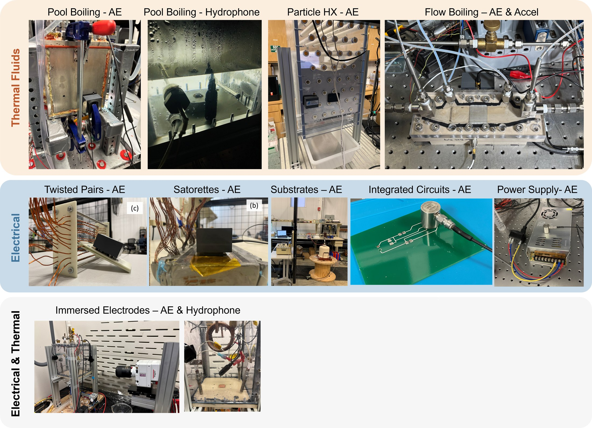

# Acoustic Sensing Systems

This folder documents the acoustic sensing hardware, data acquisition systems, and data acquisition software used in the lab. Use it as a shared reference for students preparing experiments, interpreting datasets, or writing analysis tutorials.

The figure above summarizes how acoustic emission, hydrophone, microphone, and accelerometer sensing systems are implemented across thermal-fluid and electrical experiments in AELab.

## System Summary

| System | Sensor | Data Acquisition | Software | Typical Use |
| --- | --- | --- | --- | --- |
| AE sensor system | MISTRAS R3a low-frequency AE sensor | MISTRAS EasyAE | MISTRAS AEWin | Acoustic emission hit and waveform collection. |
| Hydrophone system | High Tech HTI-96-MIN hydrophone | NI 9230 C Series sound and vibration module | NI LabVIEW | Underwater or immersed acoustic pressure measurements. |
| Microphone system | Behringer ECM8000 condenser microphone | Behringer U-PHORIA UMC404HD audio interface with Neewer NW-100 phantom power supply | NI LabVIEW | Exploratory airborne acoustic measurements near the test section. |
| Accelerometer systems | PCB Electronics ICP Model TLD352A56 and ICP Model 621C40 | NI DAQ | NI LabVIEW or NI-compatible acquisition software | Exploratory vibration/acoustic coupling measurements. |

## Folder Contents

- [mistras-easyae-system.md](mistras-easyae-system.md): MISTRAS R3a AE sensor, EasyAE DAQ, and AEWin software.
- [hydrophone-ni-system.md](hydrophone-ni-system.md): High Tech HTI-96-MIN hydrophone, NI 9230 DAQ, and LabVIEW acquisition.
- [microphone-system.md](microphone-system.md): Behringer microphone/audio-interface setup used for exploratory measurements.
- [accelerometer-systems.md](accelerometer-systems.md): PCB accelerometer systems used with NI DAQ hardware.

## Documentation Guidelines

When adding or updating system notes, include:

- Exact sensor, DAQ, and software names.
- Manufacturer links and datasheet links when available.
- Lab-specific wiring, coupling, mounting, calibration, and sampling settings.
- Known limitations or failure modes.
- The dataset folders or tutorials that use the system.

Avoid storing proprietary manuals or large vendor downloads directly in the repository unless redistribution is clearly allowed.
