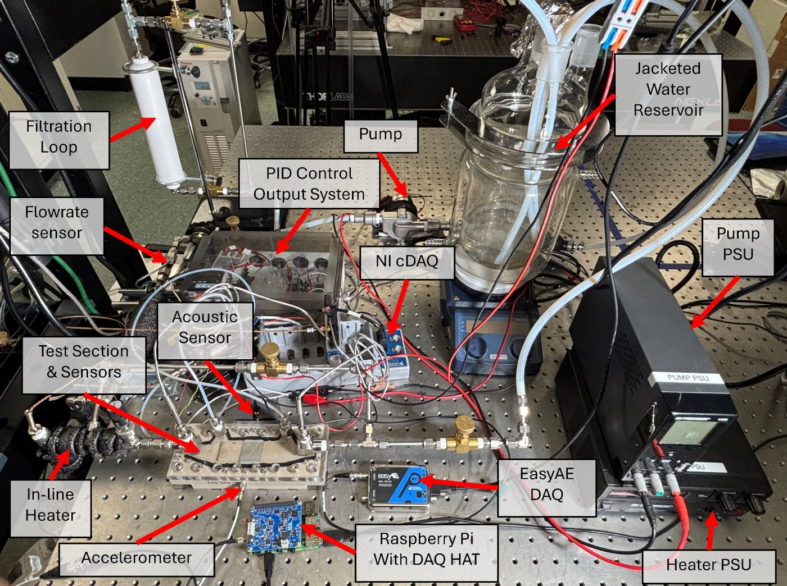

# Flow Boiling AE

Acoustic emission sensing for flow boiling in the ENRC 3414 microchannel two-phase flow loop:
standard operating procedure, data formats, data reduction, and analysis code.

---

## Standard Operating Procedure

Read these in order the first time. Afterward, [3](docs/03-easyae-acquisition.md) and
[4](docs/04-test-procedures.md) are the pages used during a run.

| # | Page | Covers |
| --- | --- | --- |
| 1 | [Facility Description and Safety](docs/01-facility-and-safety.md) | Loop layout, safety requirements, instrumentation, AE sensor mounting, acquisition architecture |
| 2 | [Software and Instrument Setup](docs/02-software-setup.md) | NI MAX, NI Package Manager, in-line heater PID via MakerHub/LINX, PSCS heater supply control, LabVIEW front panel |
| 3 | [EasyAE Acoustic Acquisition](docs/03-easyae-acquisition.md) | AEwin layout settings, acquiring `.DTA` and `.wfs`, ASCII export of hit, time-driven, and streamed waveform data |
| 4 | [Test Procedures](docs/04-test-procedures.md) | Operating envelope, steady-state and transient protocols, LabVIEW run sequence, DAQ start order, shutdown |
| 5 | [Raw Data Products](docs/05-raw-data-products.md) | Per-run file inventory and the header fields analysis code must read |
| 6 | [Data Reduction](docs/06-data-reduction.md) | Constants, flow rate from the pulse train, heater power time alignment, pressure drop spectrogram, heat split, vapor quality |
| 7 | [Acoustic Emission Features](docs/07-ae-features.md) | AE parameter definitions, export column mapping, representative results |
| 8 | [Equipment and Part List](docs/08-equipment-list.md) | Parts, manufacturers, part numbers, and known gaps |

## Quick Start for a Run

1. Verify the NI hardware and drivers — [2.1](docs/02-software-setup.md#21-ni-hardware-check-ni-max),
   [2.2](docs/02-software-setup.md#22-driver-and-runtime-check-ni-package-manager).
2. Set up the in-line heater PID and the PSCS connection to the heater supply —
   [2.3](docs/02-software-setup.md#23-in-line-heater-pid-labview-makerhub--linx),
   [2.4](docs/02-software-setup.md#24-test-section-heater-power-supply-pscs).
3. Load the AEwin layout and confirm `Hardware OK` —
   [3.2](docs/03-easyae-acquisition.md#32-acquiring-ae-data).
4. Start acquisition in order: **LabVIEW → EasyAE → Heater PSU (PSCS)** —
   [4.5](docs/04-test-procedures.md#45-sequence-of-data-acquisition).
5. Run the test, then shut down in reverse —
   [4.6](docs/04-test-procedures.md#46-shutdown).
6. Export the AE data to ASCII —
   [3.3](docs/03-easyae-acquisition.md#33-exporting-hit-and-time-driven-data-to-ascii),
   [3.4](docs/03-easyae-acquisition.md#34-exporting-streamed-waveforms-to-csv).
7. Save the PSCS data log —
   [2.4.2](docs/02-software-setup.md#242-configure-and-export-the-data-log).
8. Upload the run to the dataset host and record it in a manifest —
   [`data/`](data/README.md).

## Folder Layout

- [`docs/`](docs/): the standard operating procedure above, plus figures in `docs/assets/`.
- [`analysis/`](analysis/README.md): reusable analysis code, parsing utilities, signal processing
  scripts, and model workflows.
- [`tutorials/`](tutorials/README.md): Colab, Jupyter, MATLAB Live Script, or other instructional
  notebooks.
- [`data/`](data/README.md): dataset access notes, OSF links, metadata, and small example
  manifests.

## Related Repository Areas

- [`ae-system/mistras-easyae-system.md`](../ae-system/mistras-easyae-system.md): R3a sensor,
  EasyAE DAQ, and AEWin hardware and software notes.
- [`ae-system/accelerometer-systems.md`](../ae-system/accelerometer-systems.md): the PCB
  accelerometers mounted on the test section.
- [`pool-boiling-ae/`](../pool-boiling-ae/): pool boiling AE analysis, which shares the EasyAE
  acquisition chain and feature definitions.
- [`spier16/Mistras/EasyAE/`](../spier16/Mistras/EasyAE/): existing EasyAE notebooks, including
  `.wfs` decoding utilities.

## Contribution Notes

When adding work here, include enough information for another student to rerun the analysis from
a clean environment. Prefer scripts and notebooks that download data from OSF or another stable
online source instead of relying on local file paths.

If you change a procedure at the bench, update the matching page in `docs/` in the same pull
request. The SOP is the record other students work from, and a procedure that has drifted from
the documentation is worse than no documentation.

## Provenance

The SOP pages and figures are adapted from *Standard Operating Procedure — Microchannel
Two-phase Flow Loop with Acoustic Emission (AE) Sensing*, by Mohammad Ishraq Hossain, Daniel
Curl, and Stephen Pierson (last modified 1 Oct 2025), prepared for the NSF/CASIS FBCE project.
The text has been reorganized into the numbered pages above; equations, settings, part numbers,
and figures are reproduced from that document.

Editorial notes added during the migration are marked with blockquotes. They flag validity
limits, discrepancies between the source text and the source screenshots, and gaps to close —
they are not part of the original procedure.
