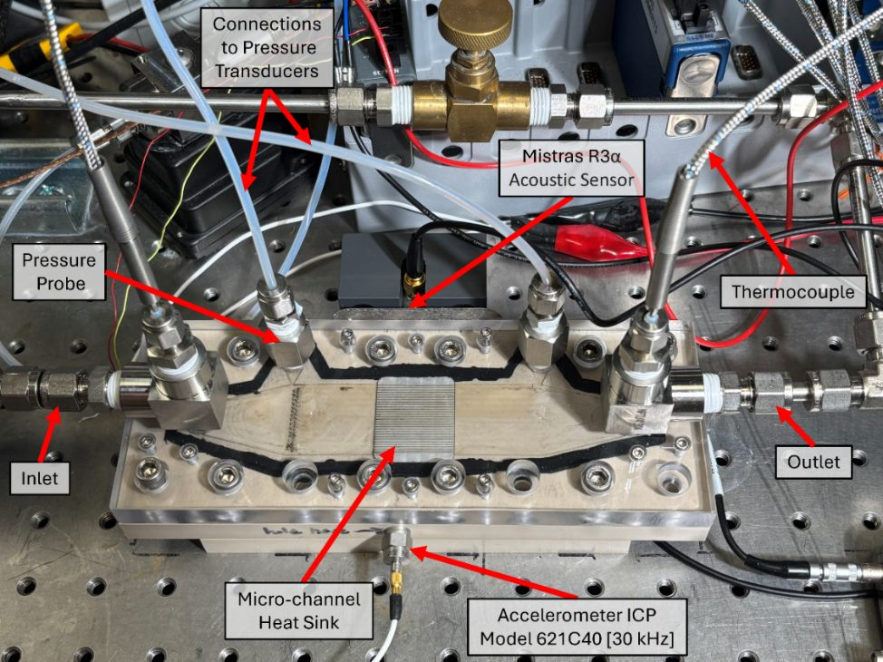

# 1. Facility Description and Safety

Microchannel two-phase flow loop with acoustic emission sensing, ENRC 3414.

> Adapted from *Standard Operating Procedure — Microchannel Two-phase Flow Loop with
> Acoustic Emission (AE) Sensing* (Hossain, Curl, and Pierson; last modified 1 Oct 2025).
> See [Provenance](../README.md#provenance).

---

## 1.1 Introduction

The experimental flow loop facility in ENRC 3414 was designed and built by Stephen Pierson to
support thermal-fluid research under controlled laboratory conditions. The system provides a
versatile platform for evaluating heat transfer performance, pressure drop, flow behavior, and
acoustic emissions in custom test sections.

Because the loop integrates electrical heating, circulating pumps, and a chiller, strict
adherence to safety procedures is required. Its operation can expose users to hot surfaces and
energized electrical connections. Pumps and valves must be handled carefully to avoid leaks,
sudden pressure surges, or overheating. The working fluid (dielectric or water-based, depending
on the experiment) must be handled in accordance with laboratory environmental, health, and
safety guidelines.

## 1.2 Safety Considerations

All personnel operating the flow loop must:

- Wear required PPE: safety glasses, lab coat, and heat-resistant gloves when applicable.
- Verify the master power switch location and emergency shutoff procedures.
- Confirm the in-line heater is disconnected until the liquid flow and temperature are stable.
- Follow the startup and shutdown sequences in [4. Test Procedures](04-test-procedures.md).

Two software interlocks are exposed on the LabVIEW front panel and should be confirmed before
every run:

| Interlock | Front-panel control | Value in the reference configuration |
| --- | --- | --- |
| Test section overheat warning | `Test Section Overheat Warning Threshold (C)` | 300 °C |
| In-line heater overheat warning | `Inline Heater Overheat Warning Threshold (C)` | 135 °C |

The red `ALL STOP` button on the front panel is the intended software stop. Do not use the
LabVIEW abort button.

## 1.3 Description of the Setup

The loop is a closed circuit that circulates de-ionized water through the test section.

**Pumping and flow control.** Flow is driven by a D5 solar pump powered independently by a
programmable DC power supply (BK Precision 1550). Liquid exiting the pump first passes through
a flow rate sensor (DwyerOmega BV1000TRN025B) before entering an in-line heater (Watlow
7.75 in., 120 V fluent heater, FLC-178). The in-line heater output is automated by a PID
control system that raises the fluid temperature to a value set by the user through the custom
LabVIEW VI. Flow rate is finely controlled with a stainless-steel Swagelok low-flow metering
valve (SS-SS4-VH) placed just before the test section inlet. The flow rate sensor sits upstream
of this valve because liquid water is incompressible, so the volumetric flow rate is uniform
around the loop. Three needle valves (5TUL2, Zoro Select) are placed across the piping network
to make the loop modular by restricting fluid passage when necessary.

**Test section.** The test section is a three-layer assembly. A transparent polycarbonate cover
plate houses the inlet/outlet fluid ports, thermocouple feedthroughs, and pressure transducer
ports. Beneath it is an insulating PEEK section containing the heat sink (straight milled
aluminum microchannel) through which the working fluid flows. The bottom PEEK layer holds a
ceramic heater (Model Y) located directly beneath the heat sink; that heater is powered by a
separate DC power supply (BK Precision 1685B). This layered architecture allows simultaneous
heating, fluid delivery, and instrumentation access while maintaining thermal and electrical
isolation.

**Heat rejection and fluid conditioning.** The heated liquid is routed into a jacketed glass
water reservoir cooled externally by a chiller (TEYU S&A CW-5200). The reservoir discharges
fluid back to the pump, giving continuous closed-loop operation. A filtration loop upstream of
the pump removes particulates and preserves fluid purity. The entire system is mounted on a
vibration-damped optical table to minimize mechanical disturbance during data collection.

**Piping.** The network is assembled from smooth-bore seamless 304 stainless steel tubing
(1/4 in. OD, 0.02 in. wall thickness), Swagelok carbon steel union elbows (S-400-9),
stainless-steel union tees (SS-400-3-4-2), and brass/steel fittings sealed with Teflon tape.

**Fig. 1** Flow loop, with the filtration loop, flowrate sensor, in-line heater, test section
and sensors, PID control output system, pump, jacketed water reservoir, NI cDAQ, acoustic
sensor, accelerometer, EasyAE DAQ, Raspberry Pi with DAQ HAT, and the pump and heater power
supplies labeled.

## 1.4 Instrumentation

Fluid pressures are measured upstream and downstream of the test section with two pressure
transducers (DwyerOmega PX2300-1BDI). Fluid temperatures are monitored with T-type
thermocouples (TJ36-CPSS-116G-3-SB) mounted at the microchannel inlet and outlet.

Vibration and acoustic data are collected by accelerometers (PCB Piezotronics TLD352A56,
10 kHz, and 621C40, 30 kHz) and by an acoustic emission sensor (MISTRAS R3a, 30 kHz low
frequency) mounted on the wall of the test-section housing, parallel to the heat sink.

**AE sensor mounting.** A magnetic sticker (SALEX X002VQXSR9) is placed on the side wall and a
magnetic hold-down (MISTRAS MHR15A) clamps onto it. The AE sensor is seated in the hold-down,
whose sponge-like element is compressed during installation and provides a small spring force
that holds the sensor securely against any flat ferromagnetic surface.

**Fig. 2** Test section, showing the inlet and outlet, pressure probes and their connections to
the pressure transducers, inlet and outlet thermocouples, microchannel heat sink, the MISTRAS
R3a acoustic sensor, and the ICP Model 621C40 (30 kHz) accelerometer.

## 1.5 Signal Acquisition Architecture

Signal acquisition is distributed across three platforms that run concurrently and are aligned
in post-processing (see [6.3 Heater power supply time alignment](06-data-reduction.md#63-heater-power-supply-time-alignment)).

| Measurement group | Hardware | Software | Output file |
| --- | --- | --- | --- |
| Thermal–hydraulic: temperatures, pressure drop, flow rate, heater duty cycle | NI cDAQ-9178 chassis with modules in Mod3 and Mod4 | Custom LabVIEW VI (`FlowLoopDAQ_v5_HSCamera.vi`) | `.lvm` |
| Acoustic emission | MISTRAS EasyAE (Model 1288-5015) with R3a sensor | AEwin64 for EasyAE | `.DTA`, `.wfs` |
| Test-section heater power | BK Precision 1685B DC power supply | PSCS remote control software | `.csv` data log |
| Vibration | Raspberry Pi 4 Model B with MCC 172 IEPE DAQ HAT | Raspberry Pi acquisition scripts | — |

> **Open item — cDAQ module numbering.** The narrative facility description lists the cDAQ
> cards as NI 9129 and NI 9239, while the NI MAX setup step and the equipment table refer to
> Mod3 as an NI 9219. NI MAX on the acquisition PC is the authoritative source. Confirm the
> installed module model before wiring and correct this note and
> [8. Equipment and Part List](08-equipment-list.md) accordingly.

## 1.6 Related Documentation

- [2. Software and Instrument Setup](02-software-setup.md)
- [3. EasyAE Acoustic Acquisition](03-easyae-acquisition.md)
- [8. Equipment and Part List](08-equipment-list.md)
- [`ae-system/mistras-easyae-system.md`](../../ae-system/mistras-easyae-system.md)
