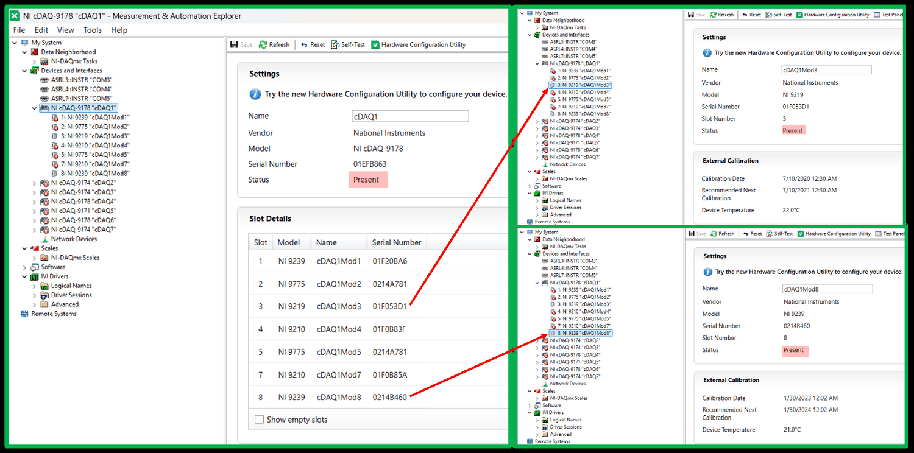
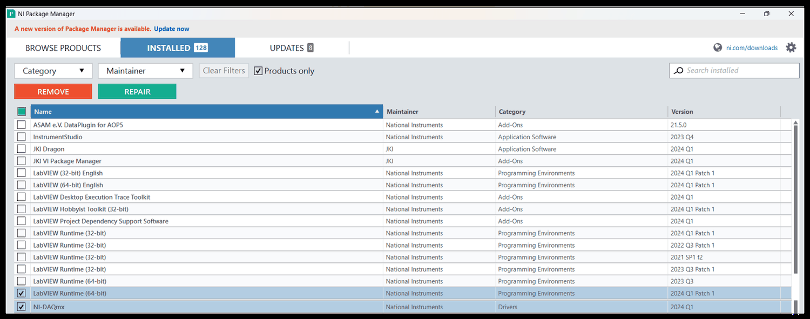
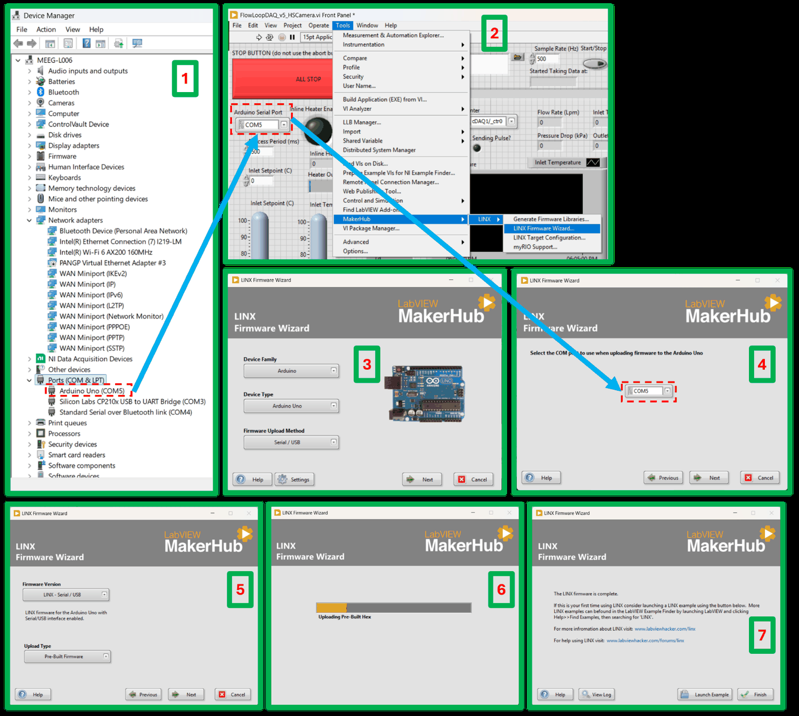
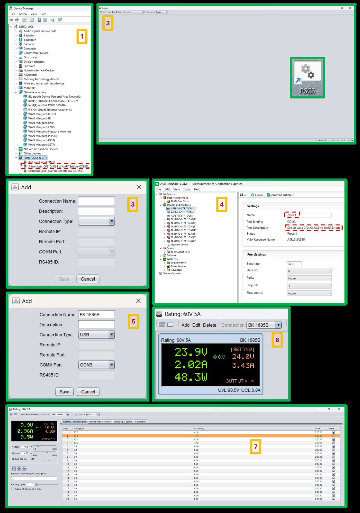
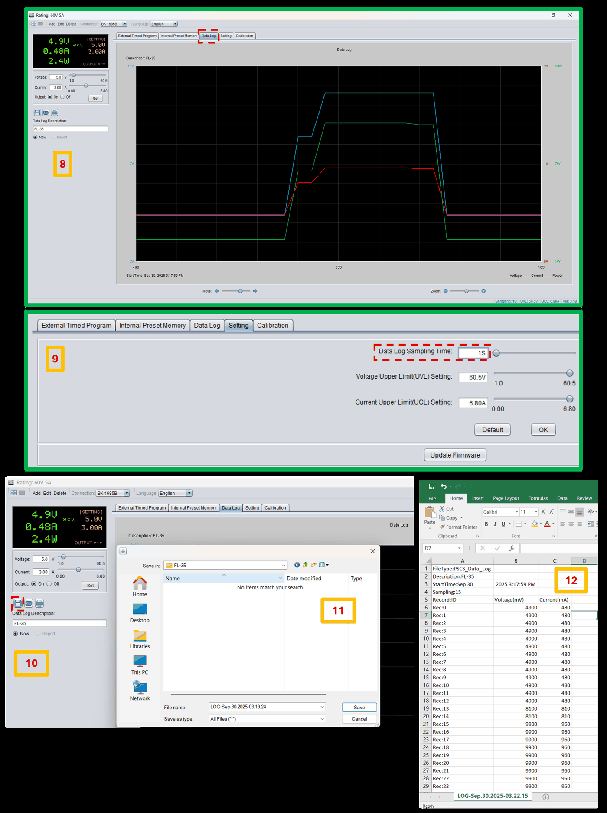
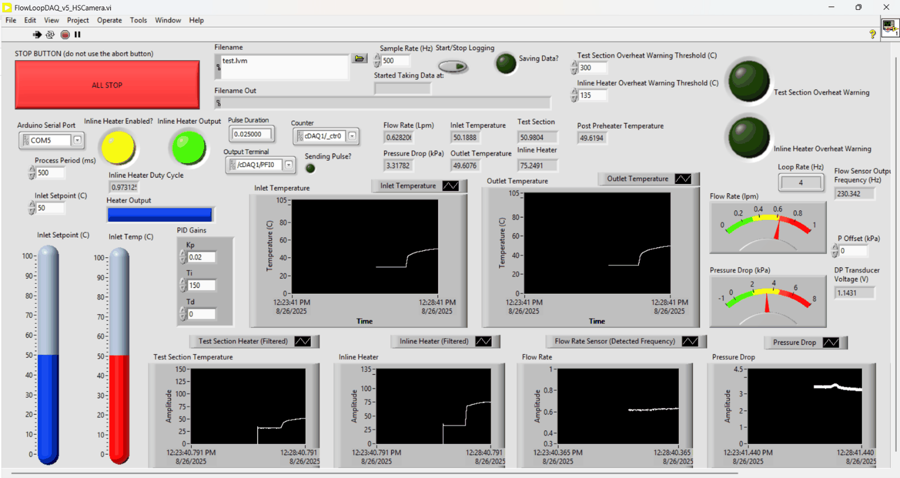

# 2. Software and Instrument Setup

Pre-run checks for the NI hardware, the LabVIEW VI, the in-line heater PID, and the
test-section heater power supply. Complete this page before
[3. EasyAE Acoustic Acquisition](03-easyae-acquisition.md).

---

## 2.1 NI Hardware Check (NI MAX)

Open **NI MAX** and confirm that the `cDAQ1` chassis (NI cDAQ-9178) is connected, along with
the two NI DAQ cards in **Mod3** and **Mod4**. Each entry must report `Status: Present`.

**Fig. 1** NI MAX. Verify that `cDAQ1` and both modules report `Present`.

## 2.2 Driver and Runtime Check (NI Package Manager)

Before running a LabVIEW VI, open **NI Package Manager** and confirm that both the **LabVIEW
Run-Time Engine** and the **NI-DAQmx** driver are installed and active. The Run-Time Engine is
required to execute LabVIEW applications; NI-DAQmx is required for communication with the NI
acquisition hardware. If either is missing, the VI may fail to launch or may be unable to
interact with the connected devices.

Both packages must be the same version (for example, LabVIEW 2024 Q1) to avoid compatibility
problems.

**Fig. 2** NI Package Manager. Confirm matching versions of the Run-Time Engine and NI-DAQmx.

## 2.3 In-Line Heater PID (LabVIEW MakerHub / LINX)

The in-line heater pre-heats the incoming liquid to a set temperature. It is integrated with
LabVIEW through MakerHub/LINX and an Arduino-based PID.

1. Open **Device Manager** and find the COM port assigned to the Arduino Uno under
   **Ports (COM & LPT)**.
2. Select that same port in the `Arduino Serial Port` control on the LabVIEW VI front panel.
3. In LabVIEW, go to **Tools → MakerHub → LINX → LINX Firmware Wizard**.
4. In the wizard, set **Device Family** to `Arduino`, **Device Type** to `Arduino Uno`, and
   **Firmware Upload Method** to `Serial / USB`.
5. Select the same COM port when the wizard asks which port to use for the firmware upload.
6. Choose firmware version `LINX - Serial / USB` with upload type `Pre-Built Firmware`, then
   let the wizard upload the pre-built hex file.
7. Finish the wizard once it reports that the LINX firmware is complete.

Complete this procedure before running the LabVIEW VI.

**Fig. 3** In-line heater PID setup. (1) Device Manager COM port for the Arduino Uno;
(2) LabVIEW **Tools → MakerHub → LINX → LINX Firmware Wizard**; (3) device family and type;
(4) COM port selection; (5) firmware version and upload type; (6) upload in progress;
(7) completion.

## 2.4 Test-Section Heater Power Supply (PSCS)

PSCS is used to remotely operate the BK Precision 1685B power supply connected to the heater
underneath the test-section heat sink.

### 2.4.1 Establish the remote connection

1. Open **Device Manager** and confirm that the supply is connected. It enumerates as
   `Silicon Labs CP210x USB to UART Bridge` under **Ports (COM & LPT)**.
2. Open the **PSCS** software and press **Add** to establish a remote connection.
3. The resulting pop-up asks for information identifying a specific device.
4. Open **NI MAX** to read the COM port and **Port Description** for that device
   (for example, `COM3`, `Silicon Labs CP210x USB to UART Bridge`, baud rate 9600, 8 data bits,
   no parity, 1 stop bit, no flow control).
5. Enter the connection information in PSCS to match NI MAX. In the reference configuration
   the connection is named `BK 1685B` with **Connection Type** `USB` and **COMM Port** `COM3`.
6. PSCS then shows the **Digital Output Panel**; click it.
7. The **Digital Control Panel** opens. Enter the settings for automated heater operation in
   the **External Timed Program** tab (voltage, current, and dwell time per step).

**Fig. 4** PSCS connection setup. (1) Device Manager; (2) PSCS launch; (3) empty `Add` dialog;
(4) NI MAX port settings; (5) completed `Add` dialog; (6) connected supply; (7) External Timed
Program schedule.

### 2.4.2 Configure and export the data log

1. Go to the **Data Log** tab to check the log history.
2. Go to the **Setting** tab and check the **Data Log Sampling Time**. If the Data Log tab
   needs to be reset, change the sampling rate *before* a test is conducted. The reference
   configuration uses `1S`.
3. After heater operation is complete, press the **Save** icon in the **Data Log** tab.
4. A file dialog opens for saving the generated CSV file.
5. Check the CSV file. It carries a header (`FileType:PSCS_Data_Log`, `Description`,
   `StartTime`, `Sampling`) followed by `Record:ID`, `Voltage(mV)`, and `Current(mA)` columns.

**Fig. 5** PSCS data log export. (8) Data Log tab; (9) Data Log Sampling Time in the Setting
tab; (10) Save icon; (11) save dialog; (12) resulting CSV opened in Excel.

> The PSCS `StartTime` in the header and the `Sampling` interval are what make the heater power
> record alignable to the LabVIEW timeline. Do not discard the header rows during
> post-processing. See [6.3](06-data-reduction.md#63-heater-power-supply-time-alignment).

## 2.5 LabVIEW Front Panel

**Fig. 6** Flow loop control center: the front panel of `FlowLoopDAQ_v5_HSCamera.vi`.

Front-panel groups, left to right:

| Group | Controls and indicators |
| --- | --- |
| Stop | `ALL STOP` (use this, not the LabVIEW abort button) |
| Arduino / PID | `Arduino Serial Port`, `Process Period (ms)`, `Inlet Setpoint (C)`, `Inline Heater Enabled?`, `Inline Heater Output`, `Inline Heater Duty Cycle`, `Heater Output`, PID gains `Kp`, `Ti`, `Td` |
| Logging | `Filename`, `Filename Out`, `Sample Rate (Hz)`, `Start/Stop Logging`, `Saving Data?`, `Started Taking Data at:` |
| Counter / flow | `Pulse Duration`, `Counter`, `Output Terminal`, `Sending Pulse?`, `Flow Rate (Lpm)`, `Flow Sensor Output Frequency (Hz)` |
| Thermal–hydraulic readouts | `Inlet Temperature`, `Outlet Temperature`, `Test Section`, `Inline Heater`, `Post Preheater Temperature`, `Pressure Drop (kPa)`, `DP Transducer Voltage (V)`, `P Offset (kPa)` |
| Safety | `Test Section Overheat Warning Threshold (C)`, `Inline Heater Overheat Warning Threshold (C)`, and the two overheat warning lamps |
| Strip charts | Inlet temperature, outlet temperature, test section heater (filtered), in-line heater (filtered), flow rate sensor (detected frequency), pressure drop |

In the reference configuration the logging sample rate is 500 Hz, the PID process period is
500 ms, and the PID gains are `Kp = 0.02`, `Ti = 150`, `Td = 0`.

## 2.6 Next Step

Continue to [3. EasyAE Acoustic Acquisition](03-easyae-acquisition.md).
