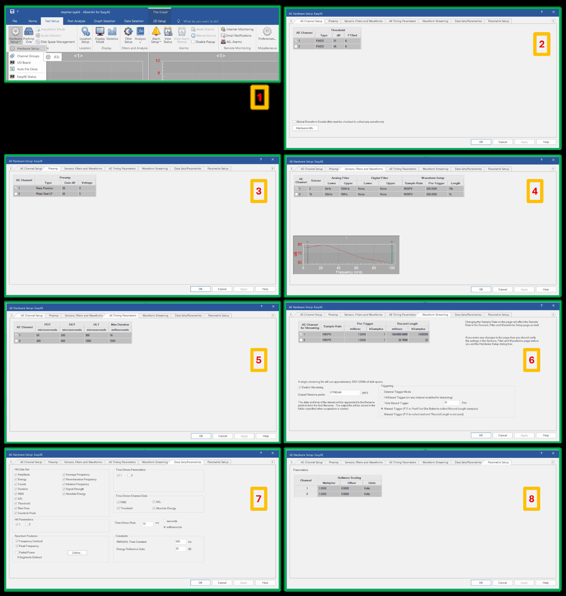
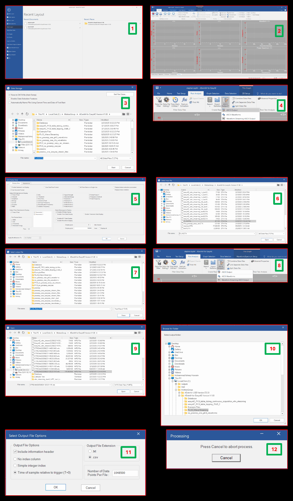
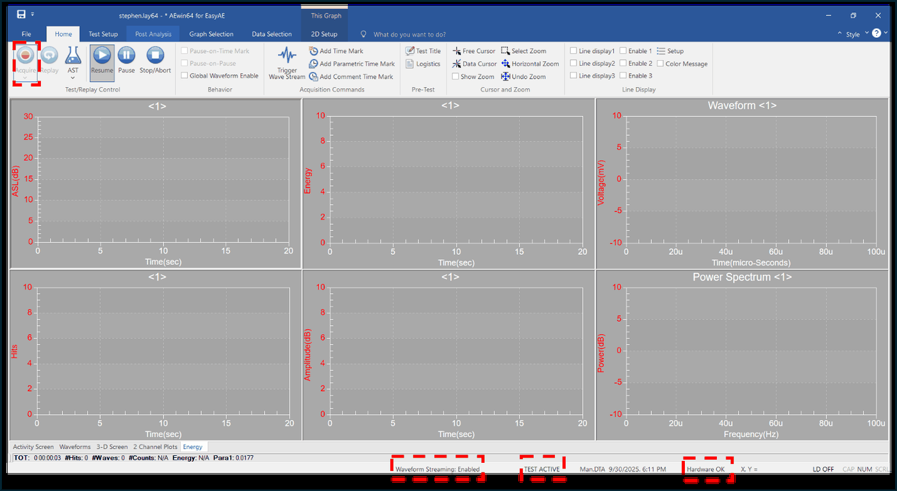
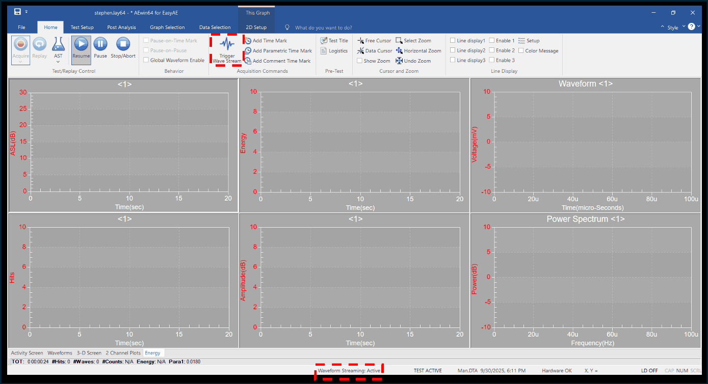

# 3. EasyAE Acoustic Acquisition

Acquiring AE hit data and streamed waveforms with the MISTRAS EasyAE DAQ and the
`AEwin64 for EasyAE` software, and exporting them to ASCII for analysis.

Prerequisite: [2. Software and Instrument Setup](02-software-setup.md).
Hardware background: [`ae-system/mistras-easyae-system.md`](../../ae-system/mistras-easyae-system.md).

---

## 3.1 Acquisition Settings in the Stored Layout

The acquisition settings are stored in a pre-designed AEwin layout file (`.lay64`), so routine
runs do not require re-entering them. The panels below record the settings in the reference
layout so that a run can be reproduced, or a deviation detected, without opening the software.

**Fig. 1** `Test Setup → Hardware Setup` in AEwin for EasyAE. (1) Menu location; (2) AE Channel
Setup; (3) Preamp; (4) Sensors, Filters and Waveforms; (5) AE Timing Parameters; (6) Waveform
Streaming; (7) Data Sets/Parametrics; (8) Parametric Setup.

Channel 1 is the enabled acquisition channel in this layout.

| Tab | Setting | Channel 1 | Channel 2 |
| --- | --- | --- | --- |
| AE Channel Setup | Threshold type | `FIXED` | `FIXED` |
| AE Channel Setup | Threshold | 31 dB | 45 dB |
| AE Channel Setup | FTBnd | 6 | 6 |
| Preamp | Type | `Rxxa, Passive` | `PKxxI, Rxxl-LP` |
| Preamp | Gain | 26 dB | 26 dB |
| Preamp | Voltage | 0 V | 5 V |
| Sensors, Filters and Waveforms | Sensor | 3 | 15 |
| Sensors, Filters and Waveforms | Analog filter | 5 kHz – 100 kHz | 20 kHz – 1 MHz |
| Sensors, Filters and Waveforms | Digital filter | None | None |
| Sensors, Filters and Waveforms | Sample rate | 1 MSPS | 1 MSPS |
| Sensors, Filters and Waveforms | Pre-trigger | 256.0000 | 256.0000 |
| Sensors, Filters and Waveforms | Waveform length | 15k | 1k |
| AE Timing Parameters | PDT (peak definition time) | 50 µs | 200 µs |
| AE Timing Parameters | HDT (hit definition time) | 200 µs | 800 µs |
| AE Timing Parameters | HLT (hit lockout time) | 300 µs | 1000 µs |
| AE Timing Parameters | Max duration | 16 ms | 1000 ms |
| Waveform Streaming | Sample rate | 1 MSPS | 1 MSPS |
| Waveform Streaming | Pre-trigger | 1.0240 ms (1 kSamples) | 1.0240 ms (1 kSamples) |
| Waveform Streaming | Record length | 1 024 000.0000 ms (1 000 000 kSamples) | 32.7680 ms (32 kSamples) |
| Parametric Setup | Software scaling | multiplier 1.0000, offset 0.0000, units Volts | multiplier 1.0000, offset 0.0000, units Volts |

**Waveform streaming.** `Enable Streaming` is checked, the output filename prefix is `STREAM`,
and the triggering mode is **Manual Trigger** (`F11` or the push-tool bar button collects
`Record Length` samples). The dialog reports that a single streaming file uses approximately
1953.125 MB of disk space — confirm free space before a long run.

**Data sets and parametrics.** The hit data set records Amplitude, Energy, Counts, Duration,
RMS, ASL, Threshold, Rise Time, Counts to Peak, Average Frequency, Reverberation Frequency,
Initiation Frequency, Signal Strength, and Absolute Energy. Spectrum features record Frequency
Centroid and Peak Frequency. Time-driven channel data records RMS, ASL, Threshold, and Absolute
Energy at a time-driven rate of 10 ms. Constants: RMS/ASL time constant 500 ms, energy reference
gain 20 dB.

> Changing the sample rate on the Waveform Streaming page also changes the sample rate on the
> Sensors, Filters and Waveforms page. After any change on that page, re-check the Sensors,
> Filters and Waveforms settings before leaving the Hardware Setup dialog.

## 3.2 Acquiring AE Data

**Fig. 2** Acquisition and ASCII export in AEwin, with the step numbers used below.

1. Open **`AEwin64 for EasyAE`**.
2. The software opens on the **Home** tab. Navigate to the **File** tab.
3. Select the pre-designed layout (`.lay64` file) by title. **[STEP 1]**
4. Check that the bottom panel of the software reads **`Hardware OK`**, which confirms the
   EasyAE DAQ is connected correctly. **[STEP 2]**
5. The software returns to the **Home** tab. Press **Acquire**.
6. A **Data Storage** file dialog opens. Enter the file name for the `.DTA` file in which the
   logged data will be stored. **[STEP 3]**
7. Press **Start** at the bottom to begin data logging. The status bar then reads:
   - `TEST ACTIVE` — data logging into the `.DTA` file has started.
   - `Waveform Streaming: Enabled` — the `.wfs` file has not been generated yet, but the DAQ
     is ready to generate it once triggered.

**Fig. 3** Acquisition started. `Waveform Streaming: Enabled`, `TEST ACTIVE`, `Hardware OK`.

8. Because **Manual Trigger** is selected in the AE Hardware Setup, press **Trigger Wave
   Stream** at the top to trigger the DAQ. `Waveform Streaming` changes from `Enabled` to
   `Active`, which means the `.wfs` file has been generated.

**Fig. 4** Waveform streaming triggered. `Waveform Streaming: Active`.

9. At the end of the test, press **Stop/Abort** at the top of the Home tab. `Waveform Streaming`
   changes from `Active` back to `Enabled`.
10. One `.DTA` file and one `.wfs` file are saved in the chosen folder for this test run.

## 3.3 Exporting Hit and Time-Driven Data to ASCII

Run this export twice: once for hit data, once for time-driven data.

1. Navigate to **Post Analysis → ASCII Output → Line Display Setup → Select Messages to
   Display**. **[STEP 4]**
2. Disable all five message check boxes and enable only **Enable Hit Data Display**. **[STEP 5]**
3. A **Select Input File** dialog opens. Scroll to the `.DTA` file you want to analyze and press
   **Open**. **[STEP 6]**
4. A **Select Output File** dialog opens. Name the file `Hit` and save it as a `.TXT` file.
   **[STEP 7]**
5. Repeat the process, but this time uncheck **Enable Hit Data Display** and check **Enable Time
   Data Display**. Save this output as a separate `.TXT` file (for example, `Time`).

## 3.4 Exporting Streamed Waveforms to CSV

1. Navigate to **Post Analysis → ASCII Output → Waveform Streaming ASCII Output**. **[STEP 8]**
2. An **Open** dialog appears. Select the `.wfs` file that corresponds to your test and press
   **Open**. **[STEP 9]**
3. A **Browse for Folder** dialog appears. Navigate to the folder where all the `.csv` files
   should be stored. **[STEP 10]**
4. A **Select Output File Options** dialog appears. Choose **Time of sample relative to trigger
   (T=0)**, keep **Include information header** checked, and select the `.csv` output file
   extension. **[STEP 11]**
5. The software processes until all CSV files have been generated in the designated folder from
   the `.wfs` file. **[STEP 12]**

> The export splits the stream into a series of CSV files with a fixed number of data points per
> file (1 048 500 in the reference configuration). Keep every part; the file name suffix encodes
> the starting sample index, which is what lets the segments be concatenated in order. See
> [5. Raw Data Products](05-raw-data-products.md#55-easyae-streamed-waveform-csv).

## 3.5 Next Step

Continue to [4. Test Procedures](04-test-procedures.md).
