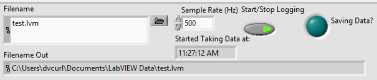

# 4. Test Procedures

Operating envelope, the steady-state and transient test protocols, the LabVIEW run sequence,
and the order in which the three acquisition systems are started.

Prerequisites: [2. Software and Instrument Setup](02-software-setup.md) and
[3. EasyAE Acoustic Acquisition](03-easyae-acquisition.md).

---

## 4.1 Operating Envelope

| Parameter | Range used | Note |
| --- | --- | --- |
| Inlet temperature | 60 °C | Ensures single-phase flow conditions |
| Inlet temperature | 95 °C | Allows both single-phase and two-phase flow regimes |
| Flow rate | 0.3 – 0.6 L/min | Range that maintains facility safety |
| Heater PSU voltage | 0 – 48 V | Supply held voltage-controlled with the input current set to 4.5 A |
| Heater output at 48 V | 179.6 W | Corresponding current 3.75 A |
| In-line heater duty cycle | Keep below 70 % | Enforced by ramping the inlet setpoint in small increments |

## 4.2 Steady-State Tests

The steady-state analysis studies the behavior of pressure drop across different flow rates and
heating conditions.

1. Set the flow rate with the metering valve and allow the loop to stabilize.
2. Bring the inlet to the target temperature (60 °C or 95 °C) using the in-line heater PID.
3. Allow the system to stabilize at the target power level and flow rate before data collection
   begins.
4. Record pressure drop data over 60 s. The 60 s window minimizes the impact of short-term
   fluctuations and gives accurate averaging.
5. Repeat for each flow rate, increasing the power level sequentially.

## 4.3 Transient Tests

1. Allow the inlet temperature to stabilize.
2. Run an automated power ramp-up and ramp-down using the PSCS **External Timed Program**, which
   remotely operates the heater power supply (see
   [2.4.1](02-software-setup.md#241-establish-the-remote-connection)).
3. Record continuously through the full ramp so that the AE, thermal–hydraulic, and heater power
   records overlap.

## 4.4 LabVIEW Run Sequence

Once the in-line heater PID control has been set up
([2.3](02-software-setup.md#23-in-line-heater-pid-labview-makerhub--linx)), press **Run** on the
LabVIEW VI front panel and follow these steps.

1. Plug the green cable powering the in-line heater into the power source.
2. Enable the in-line heater inside LabVIEW, then set `Inlet Setpoint (°C)`.
3. Increase the inlet setpoint only in small increments toward the target temperature, so that
   `Inline Heater Duty Cycle` stays below 70 %.
4. Once the desired inlet temperature is reached and every reading is close to steady state,
   enable `Start/Stop Logging` to begin recording data into a `.lvm` file.
5. Press the same button again to stop logging when the test has concluded.



**Fig. 1** LabVIEW logging controls. `Started Taking Data at:` records the wall-clock start time
of the `.lvm` file, which is needed to align the LabVIEW, AE, and heater power records.

## 4.5 Sequence of Data Acquisition

Start the three acquisition systems in this order:

```text
Flow Loop LabVIEW  >>  EasyAE DAQ  >>  Heater PSU (PSCS)
```

Starting LabVIEW first means the thermal–hydraulic record brackets both the AE record and the
heater power ramp, so the heater step can be located on a timeline that already contains the
inlet, outlet, and baseplate temperatures.

## 4.6 Shutdown

1. Stop the heater program in PSCS and save the data log
   ([2.4.2](02-software-setup.md#242-configure-and-export-the-data-log)).
2. Press **Stop/Abort** in AEwin to close the `.DTA` and `.wfs` files
   ([3.2](03-easyae-acquisition.md#32-acquiring-ae-data)).
3. Disable the in-line heater in LabVIEW and unplug the green heater cable.
4. Stop LabVIEW logging, then stop the VI with `ALL STOP`.
5. Leave the pump and chiller running until the test section and in-line heater have cooled.

## 4.7 Next Step

Continue to [5. Raw Data Products](05-raw-data-products.md).
