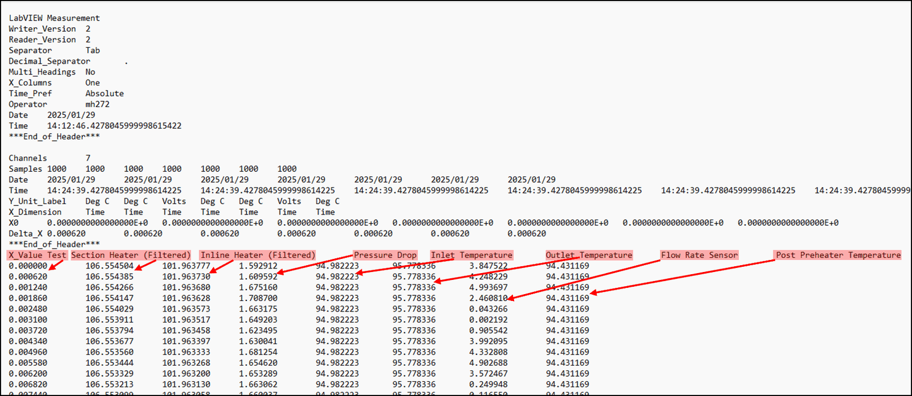
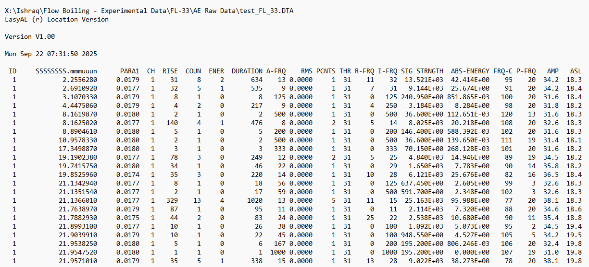
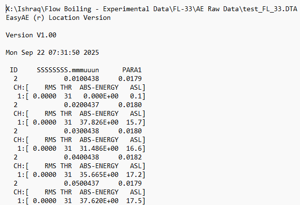
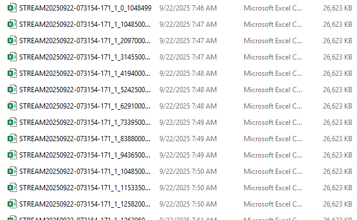
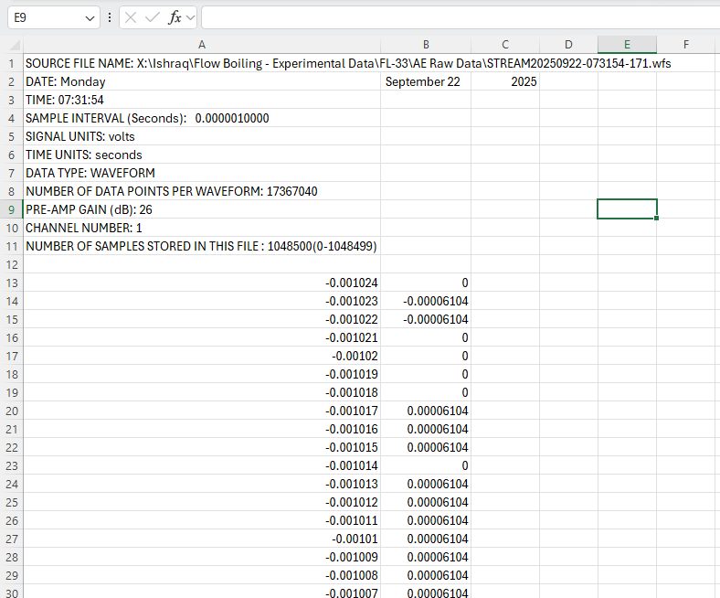

# 5. Raw Data Products

What each acquisition system writes, what the headers contain, and which fields the analysis
code depends on.

A complete test run produces one set of files from each of the three systems listed in
[1.5](01-facility-and-safety.md#15-signal-acquisition-architecture).

---

## 5.1 Per-Run File Inventory

| System | File | Contents |
| --- | --- | --- |
| LabVIEW | `<name>.lvm` | Thermal–hydraulic time series, tab-separated, with a LabVIEW Measurement header |
| EasyAE | `<name>.DTA` | Binary AE data file written during acquisition |
| EasyAE | `STREAM<timestamp>.wfs` | Binary streamed waveform file |
| EasyAE (export) | `Hit.TXT` | ASCII hit-based feature table exported from the `.DTA` |
| EasyAE (export) | `Time.TXT` | ASCII time-driven table exported from the `.DTA` |
| EasyAE (export) | `STREAM<timestamp>_<ch>_<start>.csv` | ASCII waveform segments exported from the `.wfs` |
| PSCS | `LOG-<date>-<time>.csv` | Heater power supply voltage and current log |

## 5.2 LabVIEW `.lvm`

**Fig. 1** LabVIEW `.lvm` file. The annotations mark the seven data columns.

The file opens with a LabVIEW Measurement header (`Writer_Version`, `Reader_Version`,
`Separator Tab`, `Decimal_Separator`, `Multi_Headings`, `X_Columns`, `Time_Pref Absolute`,
`Operator`, `Date`, `Time`) terminated by `***End_of_Header***`. A second header block follows
with `Channels`, `Samples`, per-channel `Date` and `Time`, `Y_Unit_Label`, `X_Dimension`, `X0`,
and `Delta_X`, terminated by a second `***End_of_Header***`.

Data columns, in order:

| Column | Quantity | Unit label |
| --- | --- | --- |
| 1 | `X_Value` (elapsed time) | Time |
| 2 | Test Section Heater (Filtered) — baseplate temperature | Deg C |
| 3 | Inline Heater (Filtered) | Deg C |
| 4 | Pressure Drop | Volts |
| 5 | Inlet Temperature | Deg C |
| 6 | Outlet Temperature | Deg C |
| 7 | Flow Rate Sensor | Volts |
| 8 | Post Preheater Temperature | Deg C |

Two header fields matter for analysis and should be read from the file rather than assumed:

- `Delta_X` gives the actual sample interval $T_s^{\mathrm{FL}}$ used by the flow rate and
  spectrogram calculations in [6. Data Reduction](06-data-reduction.md).
- The absolute `Date` and `Time` give $t_0^{\mathrm{FL}}$, the start of the flow-loop timeline,
  used to align the heater power record.

The pressure drop and flow rate sensor columns are logged as raw transducer voltages. The flow
rate sensor column is a pulse train, not a level — see
[6.2](06-data-reduction.md#62-flow-rate-from-the-pulse-train).

## 5.3 EasyAE Hit-Based ASCII

**Fig. 2** Hit-based export (`Hit.TXT`). One row per detected AE hit.

The header records the source `.DTA` path, the AEwin version, and the acquisition timestamp.
Columns:

`ID`, `SSSSSSSS.mmmuuun` (hit arrival time), `PARA1`, `CH`, `RISE`, `COUN`, `ENER`, `DURATION`,
`A-FRQ`, `RMS`, `PCNTS`, `THR`, `R-FRQ`, `I-FRQ`, `SIG STRNGTH`, `ABS-ENERGY`, `FRQ-C`, `P-FRQ`,
`AMP`, `ASL`.

The physical meaning of each feature is given in
[7. Acoustic Emission Features](07-ae-features.md).

## 5.4 EasyAE Time-Driven ASCII

**Fig. 3** Time-driven export (`Time.TXT`). One block per time step, at the time-driven rate
configured in the layout (10 ms in the reference configuration).

Each time step lists `ID`, the timestamp, and `PARA1`, followed by a per-channel block
`CH:[ RMS THR ABS-ENERGY ASL ]`. Unlike the hit export, this record is continuous and is the
natural partner for the thermal–hydraulic time series — the `ASL` column is what is plotted
against heater power and baseplate temperature in
[7.3](07-ae-features.md#73-representative-results).

## 5.5 EasyAE Streamed Waveform CSV

**Fig. 4** Exported waveform segments. The `.wfs` stream is split into equally sized CSV files.

The file name carries the stream timestamp, the channel number, and the starting sample index,
for example `STREAM20250922-073154-171_1_1048500`. Sorting by that trailing index restores the
correct order when the segments are concatenated.

**Fig. 5** Waveform CSV information header.

| Header row | Field | Value in the reference export |
| --- | --- | --- |
| 1 | `SOURCE FILE NAME` | path to the originating `.wfs` |
| 2–3 | `DATE`, `TIME` | stream start date and time |
| 4 | `SAMPLE INTERVAL (Seconds)` | `0.0000010000` (1 MSPS) |
| 5 | `SIGNAL UNITS` | `volts` |
| 6 | `TIME UNITS` | `seconds` |
| 7 | `DATA TYPE` | `WAVEFORM` |
| 8 | `NUMBER OF DATA POINTS PER WAVEFORM` | total samples in the stream |
| 9 | `PRE-AMP GAIN (dB)` | `26` |
| 10 | `CHANNEL NUMBER` | `1` |
| 11 | `NUMBER OF SAMPLES STORED IN THIS FILE` | `1048500(0-1048499)` |

Data begins on row 13: column A is the sample time relative to the trigger (`T=0`, as selected
in [3.4](03-easyae-acquisition.md#34-exporting-streamed-waveforms-to-csv)) and column B is the
signal in volts.

The sample interval and pre-amp gain in this header should be used by analysis code instead of
hard-coded constants, so that a run acquired with different layout settings is not silently
mis-scaled.

## 5.6 PSCS Heater Power Log

The PSCS CSV begins with `FileType:PSCS_Data_Log`, `Description`, `StartTime`, and `Sampling`
rows, then `Record:ID`, `Voltage(mV)`, and `Current(mA)` columns. `StartTime` and `Sampling`
define $t_0^{\mathrm{PSU}}$ and $T_s^{\mathrm{PSU}}$ for the time alignment in
[6.3](06-data-reduction.md#63-heater-power-supply-time-alignment). Export details are in
[2.4.2](02-software-setup.md#242-configure-and-export-the-data-log).

## 5.7 Storage and Naming

Raw run data is not committed to this repository. Follow
[`flow-boiling-ae/data/README.md`](../data/README.md) for dataset hosting, naming, and the
manifest fields expected for each run.

## 5.8 Next Step

Continue to [6. Data Reduction](06-data-reduction.md).
