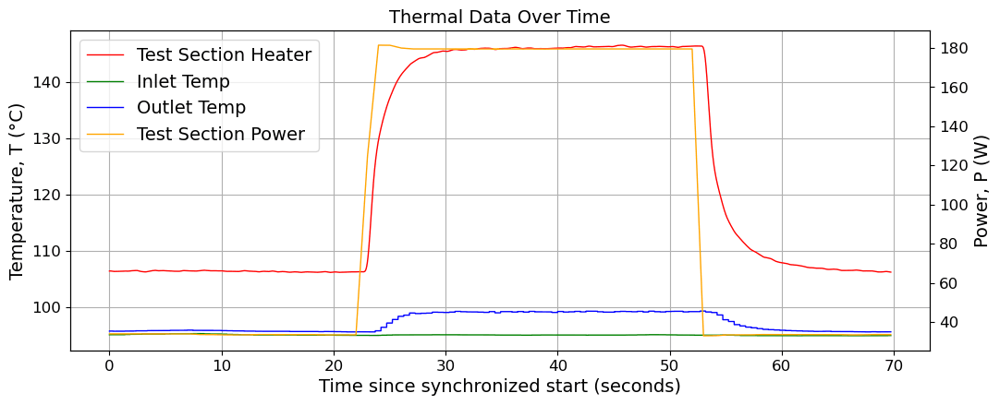
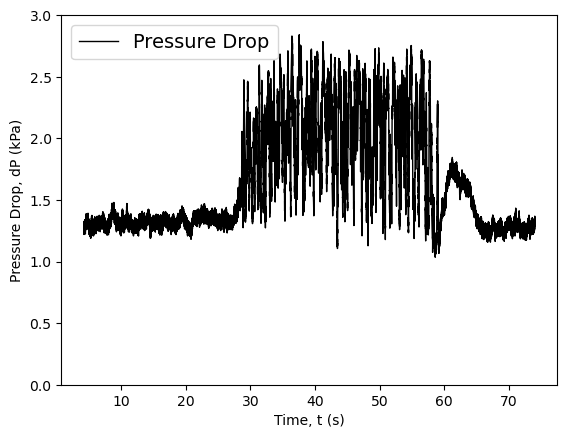
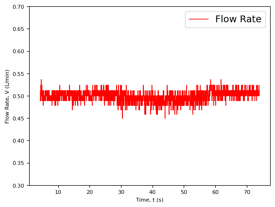
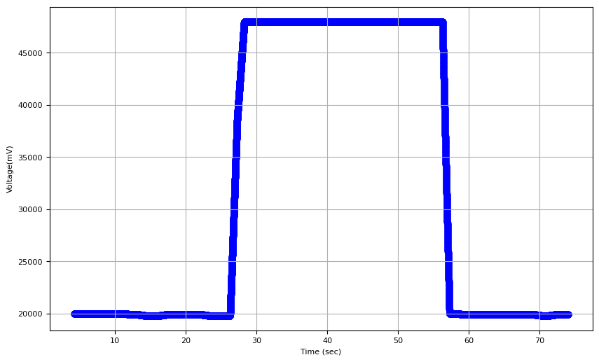
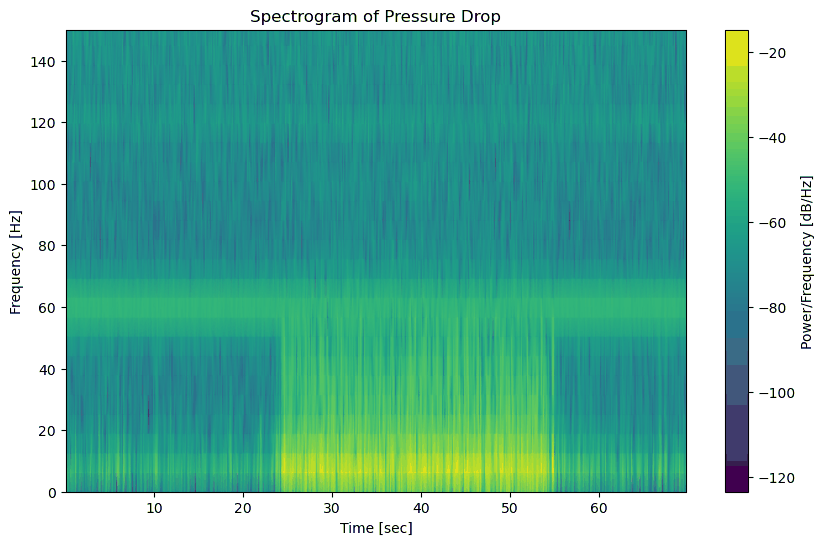
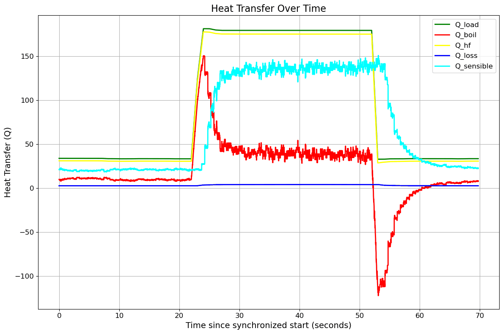
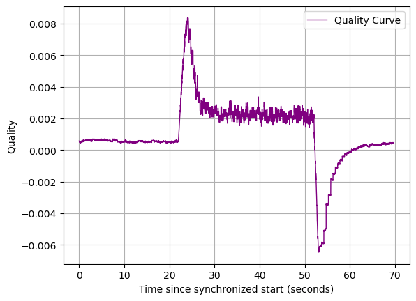
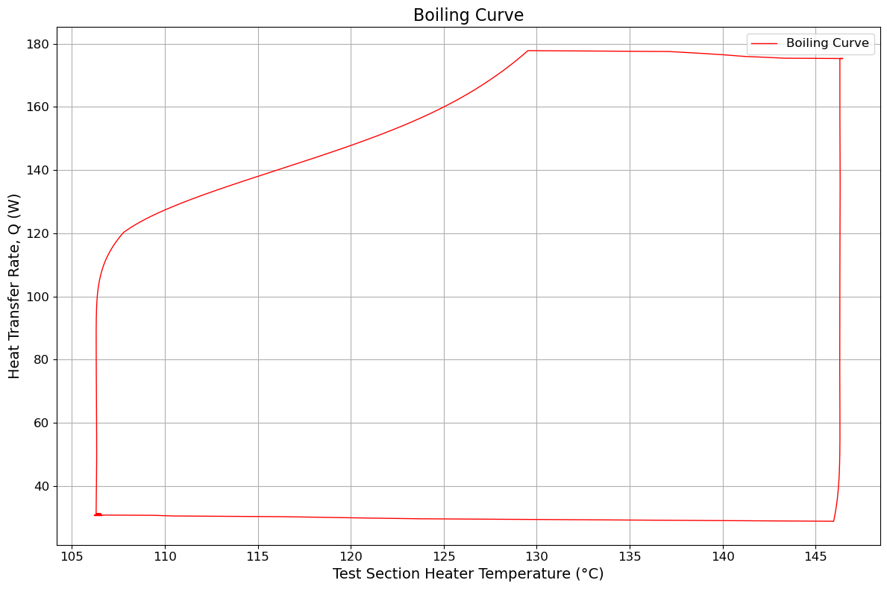
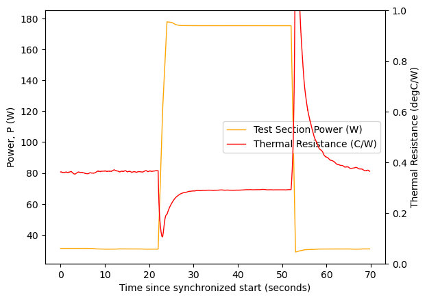

# 6. Data Reduction

Constants, conversions, time alignment, and the thermal reduction applied to a run.

Equations are reproduced from the source SOP. Figures show representative reduced output from a
single transient run; they are examples of what the reduction produces, not reference data.

---

## 6.1 Constants

Liquid properties for DI water and the heat sink geometry used throughout the reduction:

| Symbol | Quantity | Value |
| --- | --- | --- |
| $c_{p,l}$ | Specific heat of the liquid | $4215.7\ \mathrm{J\,kg^{-1}\,K^{-1}}$ |
| $\rho_l$ | Density of the liquid (DI water) | $0.95835\ \mathrm{kg\,L^{-1}}$ |
| $h_{fg}$ | Latent heat of vaporization | $2257 \times 10^{3}\ \mathrm{J\,kg^{-1}}$ |
| $w_{hs}$ | Heat sink width | $28.326 \times 10^{-3}\ \mathrm{m}$ |
| $l_{hs}$ | Heat sink length | $28.58 \times 10^{-3}\ \mathrm{m}$ |

$$A_{base} = w_{hs}\, l_{hs} \approx 8.09557 \times 10^{-4}\ \mathrm{m^2}$$

> These properties are evaluated at a single reference state, not as functions of local
> temperature. The reduction below is therefore a constant-property reduction, which is the
> appropriate accuracy class for screening pressure drop and heat split across the operating
> envelope in [4.1](04-test-procedures.md#41-operating-envelope). State this assumption whenever
> reduced values are reported.

**Fig. 1** Thermal data over time: test section heater (baseplate) temperature, inlet
temperature, outlet temperature, and test section power.

**Fig. 2** Pressure drop across the test section. The increase in fluctuation amplitude
coincides with the heated portion of the run.

## 6.2 Flow Rate from the Pulse Train

The flow rate sensor column in the `.lvm` file is a pulse train sampled at the LabVIEW sample
interval $T_s$. Pulses are detected as rising edges through a 2.5 V level:

$$\text{Rising edge at } i \quad \text{if} \quad s_i \ge 2.5 \ \text{ and } \ s_{i-1} < 2.5$$

Let $N$ be the number of rising edges counted between index $i_{last}$ and index $i$. The
average pulse period and the pulse frequency are

$$T = T_s\,\frac{i - i_{last}}{N}, \qquad f = \frac{1}{T}$$

Converting pulses per second to litres per minute uses the flow meter K-factor,
$K = 22{,}000$ pulses per litre:

$$Q_{LPM} = \frac{60}{K}\,f = \frac{60}{K\,T} = \frac{60}{K\,T_s}\,\frac{N}{\,i - i_{last}\,}$$

$Q_{LPM}$ is written $V_{LPM}$ in the thermal equations below; both denote the volumetric flow
rate in L/min.

**Fig. 3** Flow rate recovered from the pulse train.

## 6.3 Heater Power Supply Time Alignment

The PSCS heater log and the LabVIEW record are written by different systems on independent
clocks, so the heater power must be resampled onto the flow-loop timeline before any heat
balance is computed.

**PSU timeline.** The PSU sample time at index $j$ is

$$t_j = t_0^{\mathrm{PSU}} + j\,T_s^{\mathrm{PSU}}$$

where $j = 0, 1, 2, \dots$ is the discrete sample index on the PSU timeline, $t$ denotes time,
and $T$ denotes the sampling period. PSU times are uniformly sampled starting from
$t_0^{\mathrm{PSU}}$ with step $T_s^{\mathrm{PSU}}$.

**PSU signals and unit conversion.** The supply logs $V_{mV}(t_j)$ and $I_{mA}(t_j)$:

$$V(t_j) = 10^{-3}\,V_{mV}(t_j)\ \mathrm{V}, \qquad I(t_j) = 10^{-3}\,I_{mA}(t_j)\ \mathrm{A}$$

$$P^{\mathrm{PSU}}(t_j) = V(t_j)\,I(t_j)$$

**Flow-loop timeline.** Similarly, the flow-loop sample time at index $k$ is

$$t_k = t_0^{\mathrm{FL}} + k\,T_s^{\mathrm{FL}}$$

with $k = 0, 1, 2, \dots$ uniformly sampled from $t_0^{\mathrm{FL}}$ with step
$T_s^{\mathrm{FL}}$.

**Nearest-neighbor mapping.** The time separation between PSU sample $j$ and flow-loop sample
$k$ is

$$D_j(k) = \left| t_j - t_k \right|$$

For each flow-loop sample $k$, $j(k)$ is the PSU index that minimizes this distance:

$$j(k) = \arg\min_j\, D_j(k)$$

**Aligned load.** The heater power on the flow-loop timeline is then

$$Q_{load}(t_k) = P^{\mathrm{PSU}}\!\left(t_{j(k)}\right) = 10^{-6}\,V_{mV}\!\left(t_{j(k)}\right) I_{mA}\!\left(t_{j(k)}\right)\ \mathrm{W}$$

> Nearest-neighbor mapping holds the PSU value constant between PSU samples. With
> $T_s^{\mathrm{PSU}} = 1\ \mathrm{s}$ (the reference PSCS setting) and a much faster LabVIEW
> rate, the aligned $Q_{load}$ is a 1 s staircase. Any feature in the reduced heat split faster
> than 1 s reflects the LabVIEW-side signals, not the heater.

**Fig. 4** Heater power supply voltage log for a transient run.

## 6.4 Pressure Drop Spectrogram

Let the discrete pressure drop signal be

$$x(n) = dP(n)$$

with sampling period and frequency

$$T_s = \Delta t = \mathrm{time}(1) - \mathrm{time}(0), \qquad f_s = \frac{1}{T_s}$$

The short-time Fourier transform, with window length $N_w$ and hop $H$, is

$$X(m,k) = \sum_{n=0}^{N_w - 1} x(n + mH)\, w(n)\, e^{-j 2\pi k n / N_w}$$

The spectrogram (power versus time and frequency) and its decibel scaling are

$$S_{xx}(m,k) = \left| X(m,k) \right|^{2}, \qquad S_{xx}^{\mathrm{dB}}(m,k) = 10 \log_{10} S_{xx}(m,k)$$

with time and frequency axes

$$t_m = \frac{mH}{f_s}, \qquad f_k = \frac{k f_s}{N_w}$$

**Fig. 5** Spectrogram of the pressure drop signal. Report $N_w$, $H$, and the window function
alongside any spectrogram; they set the time–frequency resolution trade-off and are not
recoverable from the image.

## 6.5 Thermal Characteristics

**Heat loss to surroundings**, $Q_{loss}$: empirical parasitic losses from the heated base to
ambient, modeled as a linear function of baseplate temperature.

$$Q_{loss} = a\,(T_{base} - b)$$

The coefficients were determined empirically and are valid for the **aluminum straight
microchannel heat sink sample only**:

$$a = 0.0344, \qquad b = 24.695$$

With $Q_{loss}$ in W and $T_{base}$ in °C, $a$ carries units of W/°C and $b$ of °C. At
$T_{base} \approx 106\ \mathrm{^\circ C}$ this gives $Q_{loss} \approx 2.8\ \mathrm{W}$, which is
consistent with the $Q_{loss}$ trace in Fig. 6. **Re-determine $a$ and $b$ for any other heat
sink sample, insulation configuration, or ambient condition.**

**Net heat into the test section**, $Q_{hf}$: electrical input minus losses, the portion of power
actually reaching the coolant and test section.

$$Q_{hf} = Q_{load} - Q_{loss}$$

**Base heat flux**, $q_{base}$: net heat per unit area at the base, useful for comparing surfaces
and boiling regimes.

$$q_{base} = \frac{Q_{hf}}{A_{base}}$$

**Mass flow rate**, $\dot{m}$: coolant mass flow derived from volumetric flow (L/min) and liquid
density.

$$\dot{m} = \rho_l\,\frac{V_{LPM}}{60}$$

**Sensible (single-phase) heat**, $Q_{sensible}$: heat used to raise the liquid temperature from
inlet to outlet without phase change.

$$Q_{sensible} = \dot{m}\,c_{p,l}\,(T_o - T_i) = \rho_l\,c_{p,l}\,\frac{V_{LPM}}{60}\,(T_o - T_i)$$

**Boiling (latent) heat**, $Q_{boil}$: portion of net heat that goes into phase change after
subtracting sensible heating.

$$Q_{boil} = Q_{hf} - Q_{sensible}$$

**Overall thermal resistance**, $R_{th}$: temperature rise from inlet to base per unit total
heat — a system-level resistance in K/W.

$$R_{th} = \frac{T_{base} - T_i}{Q_{hf}}$$

**Effective area-based resistance**, $R_{eff}$: temperature rise per unit heat flux, a
surface- and area-normalized resistance in K·m²/W.

$$R_{eff} = \frac{T_{base} - T_i}{q_{base}}$$

**Fig. 6** Heat transfer over time: applied load, loss, net heat, and the sensible/latent split.

## 6.6 Outlet Vapor Quality

**Outlet vapor quality**, $x_{out}$: vapor mass fraction at the outlet.

$$x_{out} = \frac{Q_{boil}}{\dot{m}\,h_{fg}} = \frac{Q_{boil}}{\rho_l\,\dfrac{V_{LPM}}{60}\,h_{fg}}$$

**Fig. 7** Outlet vapor quality for a transient run.

> $Q_{boil}$ and $x_{out}$ are defined as residuals of the net heat after the sensible term.
> Where the outlet is subcooled — most visibly during the ramp-down in Fig. 7 — the sensible
> term computed from $(T_o - T_i)$ exceeds $Q_{hf}$ and the residual goes negative. A negative
> $x_{out}$ is an artifact of applying the definition outside its validity range, not a
> measurement. Screen for outlet saturation before interpreting $x_{out}$, and report
> $x_{out}$ only where that screen passes.

## 6.7 Derived Curves

**Fig. 8** Boiling curve, plotted as heat transfer rate against test-section heater temperature.
The loop traced between the ramp-up and ramp-down branches reflects the thermal lag of the
baseplate during a transient run; a steady-state boiling curve requires the protocol in
[4.2](04-test-procedures.md#42-steady-state-tests).

**Fig. 9** Test section power and overall thermal resistance over time. $R_{th}$ is undefined as
$Q_{hf} \to 0$; mask the low-power intervals rather than plotting the divergence.

## 6.8 Next Step

Continue to [7. Acoustic Emission Features](07-ae-features.md).
