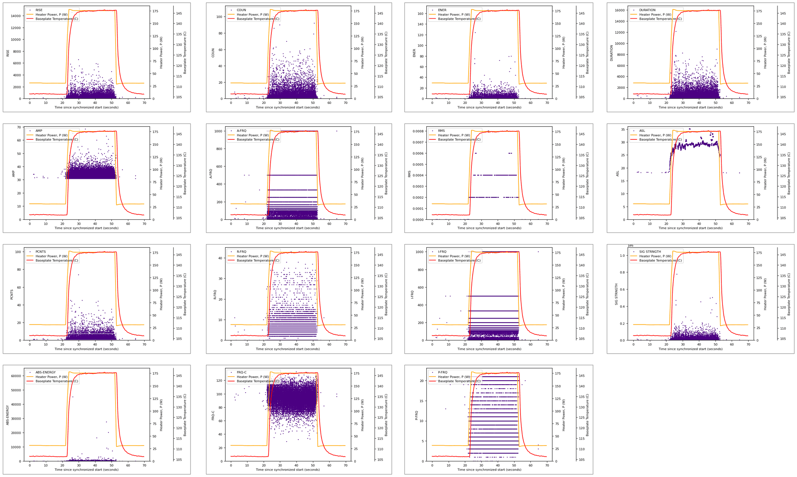
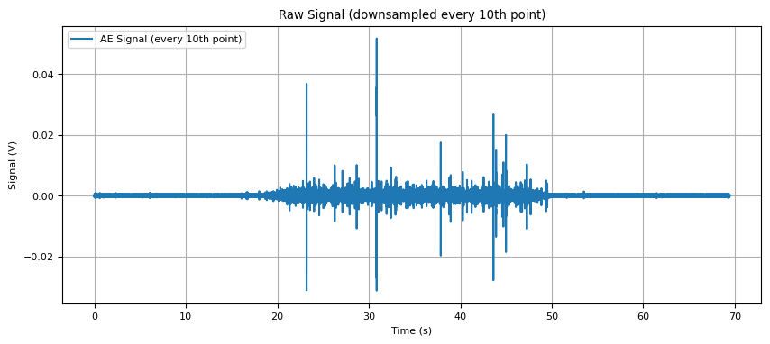
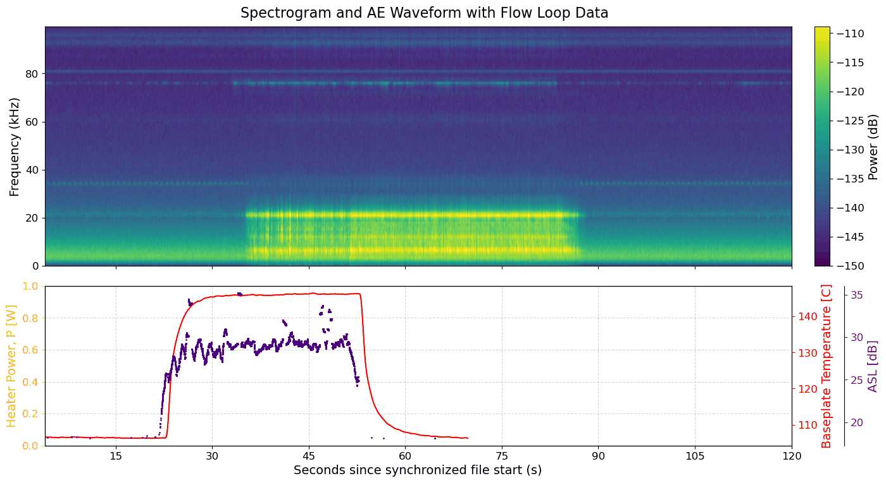
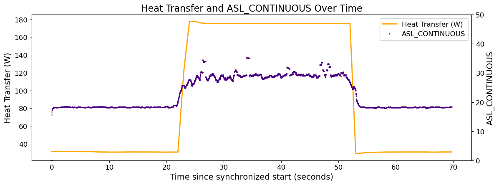

# 7. Acoustic Emission Features

Definitions of the AE parameters recorded by EasyAE, the mapping from those definitions to the
column codes in the ASCII exports, and representative results.

---

## 7.1 Hit Feature Definitions

For the acquisition settings that produce these features — threshold, PDT, HDT, HLT, and the
enabled data set — see
[3.1](03-easyae-acquisition.md#31-acquisition-settings-in-the-stored-layout).

| Parameter | Definition |
| --- | --- |
| **Amplitude** | Highest voltage in the AE waveform, expressed on the dBAE amplitude scale. |
| **Energy** | Time integral of the absolute signal voltage. The reported magnitude depends on the value selected for Energy Reference Gain. Proportional to Signal Strength. |
| **Counts** | Number of times the signal crosses the detection threshold. |
| **Duration** | Time from first to last threshold crossing (µs). |
| **RMS** | Root mean square voltage during a period of time, based on a software-programmable time constant, referred to the input to the signal processing board. |
| **ASL** | RMS converted to the dBAE scale (0 dBAE = 1 µV at the sensor before any amplification). |
| **Threshold** | Detection threshold on the dBAE scale. Not particularly useful for Fixed Threshold, because the value does not change during acquisition. It is useful for Floating and Smart Threshold modes. |
| **Rise Time** | Time from first threshold crossing to the highest voltage point on the waveform (µs). |
| **Counts to Peak** | Number of threshold crossings from first crossing to the highest voltage point on the waveform. |
| **Average Frequency** | Counts divided by Duration, divided by 1000 (thus, kHz). This is not a spectral-domain calculation but a calculation from time-domain features. |
| **Reverberation Frequency** | (Counts − Counts to Peak) divided by (Duration − Rise Time). |
| **Initiation Frequency** | Counts to Peak divided by Rise Time. |
| **Signal Strength** | Time integral of the absolute signal voltage, expressed in pVs (picovolt-seconds) referenced to the sensor before any amplification. Proportional to Energy. |
| **Absolute Energy** | Time integral of the square of the signal voltage at the sensor before any amplification, divided by a 10 kΩ impedance and expressed in aJ (attojoules). |

> Average Frequency, Reverberation Frequency, and Initiation Frequency are ratios of
> threshold-crossing counts to time intervals. They are threshold-dependent descriptors of
> waveform shape, not spectral measurements, and they are not comparable across runs acquired
> with different thresholds or timing parameters.

## 7.2 Export Column Mapping

The hit ASCII export uses short column codes
([5.3](05-raw-data-products.md#53-easyae-hit-based-ascii)). They map to the definitions above as
follows.

| Column code | Parameter |
| --- | --- |
| `AMP` | Amplitude |
| `ENER` | Energy |
| `COUN` | Counts |
| `DURATION` | Duration |
| `RMS` | RMS |
| `ASL` | ASL |
| `THR` | Threshold |
| `RISE` | Rise Time |
| `PCNTS` | Counts to Peak |
| `A-FRQ` | Average Frequency |
| `R-FRQ` | Reverberation Frequency |
| `I-FRQ` | Initiation Frequency |
| `SIG STRNGTH` | Signal Strength |
| `ABS-ENERGY` | Absolute Energy |
| `FRQ-C` | Frequency Centroid (spectrum feature) |
| `P-FRQ` | Peak Frequency (spectrum feature) |

`FRQ-C` and `P-FRQ` are the two spectrum features enabled in the layout's
**Data Sets/Parametrics** tab. The source SOP does not define them. Check the AEWin
documentation before reporting them, and record the definitions in
[`ae-system/mistras-easyae-system.md`](../../ae-system/mistras-easyae-system.md) once confirmed.

## 7.3 Representative Results

The figures below come from a single transient run in which the test-section heater was ramped
up, held, and ramped down. In each panel the heater power and baseplate temperature are overlaid
so that the AE response can be read against the thermal state.

**Fig. 1** Hit features versus time for one transient run: RISE, COUN, ENER, DURATION, AMP,
A-FRQ, RMS, ASL, PCNTS, R-FRQ, I-FRQ, SIG STRNGTH, ABS-ENERGY, FRQ-C, and P-FRQ, each with
heater power (orange) and baseplate temperature (red).

Hit activity in every feature is confined to the heated interval, which indicates that the hits
are generated by the heating process rather than by loop background. Several features — `A-FRQ`,
`I-FRQ`, `R-FRQ`, and `P-FRQ` — show horizontal banding, which is the expected signature of a
ratio formed from small integer counts and quantized times, and is a reason to prefer the
continuous `ASL` record for correlating against thermal quantities.

**Fig. 2** Raw streamed AE waveform (plotted at every tenth point). Signal amplitude rises during
the heated interval and returns to the background level afterward.

**Fig. 3** AE waveform spectrogram with the synchronized flow loop record beneath: heater power,
baseplate temperature, and ASL on a common time axis. Broadband content below roughly 25 kHz
strengthens over the heated interval, consistent with the R3a sensor's 30 kHz low-frequency
response and the 5 kHz – 100 kHz analog filter set in the layout.

**Fig. 4** Heat transfer and time-driven (continuous) ASL over time. The ASL step tracks the
heater step, which is the basic result that motivates using AE as a non-intrusive indicator of
the boiling state.

> These figures are single-run examples included to show what the workflow produces. They are not
> a validated correlation between AE features and boiling regime. Any such claim requires
> repeated runs across the operating envelope, an explicit uncertainty treatment, and a stated
> screen for the flow regime at each condition.

## 7.4 Next Step

Continue to [8. Equipment and Part List](08-equipment-list.md).
